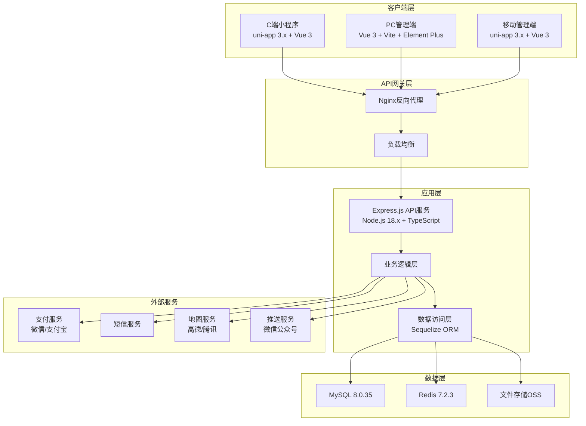

# 叨叨房车租赁平台 - 技术架构

## 技术架构概述

叨叨房车租赁平台采用现代化全栈技术架构，基于微服务理念设计，确保系统的高可用性、可扩展性和可维护性。平台支持多终端访问，为不同用户提供优化的使用体验。

## 技术栈选择

### 前端技术栈

#### C端小程序 (用户端) - miniprogram/
- **框架**: uni-app 3.0.0 + Vue 3.5.0 + TypeScript 5.1.6
- **UI组件库**: uni-ui 官方组件库
- **开发工具**: HBuilderX
- **构建工具**: HBuilderX内置编译
- **目标平台**: 微信小程序、H5网页

#### B端PC管理端 - admin-console/
- **框架**: Vue 3.5.0 + TypeScript 5.1.6
- **构建工具**: Vite 4.4.9
- **UI组件库**: Element Plus 2.11.7 (按需引入)
- **状态管理**: Pinia 2.1.6
- **路由管理**: Vue Router 4.2.5
- **HTTP客户端**: Axios 1.4.0
- **开发工具**: VS Code
- **自动导入**: unplugin-auto-import + unplugin-vue-components

#### B端移动管理端 - mobile-admin/
- **框架**: uni-app 3.0.0 + Vue 3.5.0 + TypeScript 5.1.6
- **UI组件库**: uni-ui 官方组件库
- **开发工具**: HBuilderX
- **目标平台**: 微信小程序、H5网页

### 后端技术栈

#### 核心框架 - backend/
- **运行环境**: Node.js 18.18.0 LTS
- **Web框架**: Express.js 4.18.2 + TypeScript 5.1.6
- **API设计**: RESTful API
- **开发语言**: TypeScript

#### 数据存储
- **关系型数据库**: MySQL 8.0.35 (Docker部署)
- **缓存数据库**: Redis 7.2.3 (Docker部署)
- **文件存储**: 阿里云OSS / 腾讯云COS
- **搜索引擎**: Elasticsearch (可选，用于搜索功能)

#### 数据访问层
- **ORM框架**: Sequelize 6.32.1 + @types/sequelize
- **数据库驱动**: mysql2 3.6.5 + @types/mysql2
- **连接池**: MySQL2内置连接池
- **数据验证**: class-validator 0.14.0 + class-transformer 0.5.1

#### 中间件与工具
- **身份认证**: JWT (jsonwebtoken 9.0.2) + bcrypt 5.1.1
- **安全防护**: Helmet 7.1.0, CORS 2.8.5, express-rate-limit
- **日志管理**: Morgan + Winston
- **文件上传**: Multer 1.4.5-lts.1
- **会话管理**: express-session
- **定时任务**: node-cron 3.0.3
- **API文档**: Swagger/OpenAPI
- **测试框架**: Jest + Supertest

#### 部署与运维
- **容器化**: Docker + Docker Compose
- **反向代理**: Nginx
- **进程管理**: PM2
- **监控告警**: Prometheus + Grafana (可选)
- **日志收集**: ELK Stack (可选)

## 系统架构设计

### 整体架构



### 技术栈矩阵 (最新版本)

| 端 | 类型 | 框架 | UI组件库 | 状态管理 | 构建工具 | 开发语言 | 项目路径 |
|---|---|---|---|---|---|---|---|
| **C端小程序** | 用户端 | uni-app 3.0.0 + Vue 3.5.0 | uni-ui | Vue 3 Composition API | HBuilderX | TypeScript 5.1.6 | `miniprogram/` |
| **B端PC管理** | 管理端 | Vue 3 + Vite | Element Plus 2.11.7 | Pinia 2.1.6 | Vite 4.4.9 | TypeScript 5.1.6 | `admin-console/` |
| **B端移动管理** | 管理端 | uni-app 3.0.0 + Vue 3.5.0 | uni-ui | Vue 3 Composition API | HBuilderX | TypeScript 5.1.6 | `mobile-admin/` |
| **后端API** | 服务端 | Express.js 4.18.2 | - | - | Node.js 18.18.0 | TypeScript 5.1.6 | `backend/` |

## 应用架构设计

### 分层架构设计
1. **表现层 (Presentation Layer)**
   - Vue组件、页面渲染
   - 用户交互处理
   - 前端路由管理

2. **应用层 (Application Layer)**
   - API路由定义
   - 请求参数验证
   - 响应格式化

3. **业务层 (Business Layer)**
   - 业务逻辑实现
   - 服务编排
   - 事务管理

4. **数据层 (Data Layer)**
   - 数据模型定义
   - 数据库操作
   - 缓存管理

### 模块化设计

#### 后端模块架构
- **认证模块**: 用户认证、JWT管理、权限控制
- **用户模块**: 用户管理、标签管理、信用评估
- **车辆模块**: 车辆管理、状态管理、调度配置
- **订单模块**: 订单处理、状态流转、支付管理
- **支付模块**: 支付集成、退款处理、财务管理
- **门店模块**: 门店管理、员工分配、服务配置
- **众筹模块**: 众筹管理、分润计算、份额管理
- **营销模块**: 营销活动、优惠券、价格管理
- **系统模块**: 系统配置、权限管理、日志审计

## API设计规范

### RESTful API架构
- **统一API入口**: 三端使用统一API路径，通过JWT角色权限控制访问范围
- **路径结构**: `/api/v1/{module}/` 按业务模块划分，不按端隔离
- **权限控制**: 基于JWT Token中的用户类型和权限进行验证

#### API路径设计
```
/api/v1/auth/*           - 认证相关API
/api/v1/users/*          - 用户管理API
/api/v1/vehicles/*       - 车辆管理API
/api/v1/orders/*         - 订单管理API
/api/v1/payments/*       - 支付相关API
/api/v1/content/*        - 内容管理API
/api/v1/system/*         - 系统管理API
```

#### JWT Token结构
```json
{
  "userId": 12345,
  "userType": "customer|mobile_admin|pc_admin",
  "roleId": 2,
  "permissions": ["order:read", "order:create"],
  "storeId": 5,
  "exp": 1736789400,
  "iat": 1736703000
}
```

### 统一响应格式

#### 成功响应格式
```json
{
  "code": 0,
  "message": "success",
  "data": {},
  "meta": {
    "requestId": "abc-123",
    "timestamp": "2025-11-12T10:00:00+08:00"
  }
}
```

#### 分页响应格式
```json
{
  "code": 0,
  "message": "success",
  "data": [
    {"id": 1, "name": "订单1"},
    {"id": 2, "name": "订单2"}
  ],
  "pagination": {
    "page": 1,
    "pageSize": 20,
    "total": 150,
    "pages": 8
  }
}
```

#### 错误响应格式
```json
{
  "code": 100102,
  "message": "ORDER_NOT_FOUND",
  "details": "订单不存在或已取消",
  "meta": {
    "requestId": "req_1736728800000_003",
    "timestamp": "2025-11-12T10:00:00+08:00"
  }
}
```

## 开发原则

### 代码规范

#### 前端规范
- **Vue 3 Composition API**: 优先使用 `<script setup>` 语法
- **TypeScript**: 严格类型检查，完整的类型定义
- **组件化开发**: 每个组件职责单一，可复用
- **状态管理**: Pinia状态管理，模块化组织
- **样式规范**: CSS预处理器，统一设计规范

#### 后端规范
- **TypeScript**: 严格类型检查，完整的类型定义
- **RESTful设计**: 遵循REST API设计原则
- **错误处理**: 统一的错误响应格式
- **日志记录**: 结构化日志，完整的操作审计
- **安全第一**: 输入验证、SQL注入防护、XSS防护

### 性能优化

#### 前端优化
- **懒加载**: 路由和组件的懒加载
- **代码分割**: 按需加载，减少初始包大小
- **缓存策略**: 合理使用浏览器缓存和CDN
- **图片优化**: 压缩图片，使用WebP格式

#### 后端优化
- **数据库优化**: 合理使用索引，优化查询语句
- **缓存策略**: Redis缓存热点数据
- **连接池**: 数据库连接池管理
- **异步处理**: 耗时操作异步化处理

### 安全策略

#### 身份认证与授权
- **JWT Token**: 无状态的身份认证
- **角色权限**: 基于角色的访问控制(RBAC)
- **API限流**: 防止接口恶意调用
- **HTTPS**: 全站HTTPS加密传输

#### 数据安全
- **数据加密**: 敏感数据加密存储
- **SQL注入防护**: 参数化查询
- **XSS防护**: 输入输出过滤
- **CSRF防护**: Token验证

## 数据库设计

### 技术选型
- **MySQL 8.0.35**: 主数据库，支持JSON字段
- **Redis 7.2.3**: 缓存和会话存储
- **字符集**: utf8mb4，支持完整Unicode
- **排序规则**: utf8mb4_unicode_ci
- **时区**: +08:00

### 设计规范
- **三范式**: 遵循数据库设计三范式
- **索引优化**: 合理创建索引，提高查询性能
- **字段命名**: 统一的命名规范 (snake_case)
- **数据类型**: 合理选择数据类型，节省存储空间
- **时间戳**: 所有表包含 created_at, updated_at

## 测试策略

### 前端测试
- **单元测试**: Vitest/Jest 组件单元测试
- **集成测试**: 组件间集成测试
- **E2E测试**: Cypress 端到端测试 (可选)

### 后端测试
- **单元测试**: Jest 服务和工具函数测试
- **集成测试**: Supertest API接口测试
- **数据库测试**: 数据模型和迁移测试

## 部署架构

### 环境管理
- **开发环境**: 本地开发环境
- **测试环境**: 功能测试环境
- **预生产环境**: 生产前验证环境
- **生产环境**: 正式运行环境

### Docker化部署
```yaml
# docker-compose.yml 核心服务
services:
  mysql:      # MySQL 8.0.35 数据库
  redis:      # Redis 7.2.3 缓存
  adminer:    # 数据库管理工具 (端口8080)
  backend:    # Node.js 后端服务 (端口3000)
  frontend:   # Vue 3 PC管理端 (端口5173)
```

### CI/CD流程
- **代码提交**: Git版本控制
- **自动构建**: 代码提交触发自动构建
- **自动测试**: 构建后运行测试套件
- **自动部署**: 测试通过后自动部署

## 监控与运维

### 系统监控
- **性能监控**: 响应时间、吞吐量监控
- **错误监控**: 错误日志收集和告警
- **资源监控**: CPU、内存、磁盘监控
- **业务监控**: 关键业务指标监控

### 日志管理
- **结构化日志**: JSON格式日志
- **日志分级**: 不同级别的日志记录
- **日志聚合**: 集中式日志收集
- **日志分析**: 日志查询和分析

## 开发环境配置

### 端口分配
| 服务 | 端口 | 用途 |
|------|------|------|
| 后端API | 3000 | Express服务 |
| PC管理端 | 5173 | Vite开发服务器 |
| MySQL | 3306 | 数据库服务 |
| Redis | 6379 | 缓存服务 |
| Adminer | 8080 | 数据库管理工具 |

### 开发分工
| 开发者 | 负责模块 | 开发工具 | 项目路径 |
|--------|----------|----------|----------|
| **您** | miniprogram (小程序端) | HBuilderX | `miniprogram/` |
| **您** | mobile-admin (移动管理) | HBuilderX | `mobile-admin/` |
| **我** | admin-console (PC管理端) | VS Code | `admin-console/` |
| **我** | backend (后端API) | VS Code | `backend/` |

## 技术债务管理

### 代码质量
- **代码审查**: 强制代码审查流程
- **静态分析**: ESLint、SonarQube等工具
- **重构计划**: 定期重构老旧代码
- **技术选型**: 谨慎选择新技术

### 文档维护
- **API文档**: Swagger自动生成和更新
- **架构文档**: 定期更新架构设计文档
- **部署文档**: 详细部署和运维文档
- **开发文档**: 开发规范和最佳实践

## 版本控制策略

### 依赖版本管理
- **精确版本**: 所有依赖使用精确版本号
- **定期更新**: 定期更新依赖版本
- **安全更新**: 及时更新有安全漏洞的依赖
- **兼容性测试**: 更新前进行兼容性测试

### 分支管理
- **master**: 生产环境代码
- **develop**: 开发环境代码
- **feature/***: 功能开发分支
- **hotfix/***: 紧急修复分支