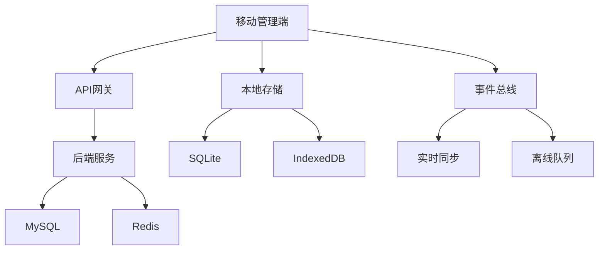

# 移动管理端开发需求文档

**文档版本**: v1.0 | **创建时间**: 2025-11-13 | **开发周期**: 18天 | **技术栈**: uni-app 3.x + Vue 3 + TypeScript

---

## 📋 项目概述

### 项目背景
叨叨房车移动管理端是面向门店与总部运营团队的外勤管理工具，作为PC管理端的场景化补充，确保运营人员在外出、驻店、现场等非办公环境下也能高效处理关键业务。

### 技术架构选择
根据项目需求和技术调研，确定以下技术方案：

**前端技术栈**:
- **框架**: uni-app 3.x + Vue 3 + TypeScript
- **UI组件库**: uni-ui + 自定义组件
- **状态管理**: Pinia
- **数据同步**: 基于事件驱动的实时同步
- **离线存储**: SQLite + IndexedDB
- **核验模板**: 动态可配置的检查模板系统

**核心特性**:
- 🌐 PWA支持，原生应用体验
- 📱 现场操作优化，支持单手操作
- 🔄 离线优先，自动同步数据
- 📸 多媒体采集，拍照录音支持
- ⚡ 实时通信，事件驱动架构

---

## 🏗️ 系统架构设计

### 1. 整体架构



### 2. 技术选型说明

#### 2.1 UI组件库选择 - uni-ui + 自定义组件

**选择理由**:
- uni-ui与uni-app深度集成，兼容性最佳
- 针对移动端优化，性能优异
- 组件丰富，覆盖大部分业务场景
- 支持自定义主题，符合品牌规范

**自定义组件规划**:
```typescript
// 业务组件库
components/
├── business/
│   ├── FieldChecklist/      // 现场检查组件
│   ├── PhotoUploader/       // 图片上传组件
│   ├── SignaturePad/        // 电子签名组件
│   ├── TaskCard/           // 任务卡片组件
│   └── OrderStatusTracker/ // 订单状态跟踪器
├── layout/
│   ├── TabBar/            // 底部导航
│   ├── PageHeader/        // 页面头部
│   └── FloatingButton/    // 悬浮按钮
└── common/
    ├── DataSync/          // 数据同步指示器
    ├── OfflineBanner/     // 离线提示
    └── PermissionCheck/   // 权限检查
```

#### 2.2 数据同步策略 - 基于事件驱动

**架构设计**:
```typescript
// 事件驱动架构
interface SyncEvent {
  id: string
  type: 'create' | 'update' | 'delete'
  resource: string
  data: any
  timestamp: number
  userId: string
}

class EventDrivenSync {
  private eventQueue: SyncEvent[] = []
  private subscribers: Map<string, Function[]> = new Map()

  // 发布事件
  publish(event: SyncEvent): void

  // 订阅事件
  subscribe(resource: string, handler: Function): void

  // 处理同步
  processSync(): Promise<void>
}
```

**同步策略**:
- **实时同步**: 订单状态、紧急消息（WebSocket）
- **批量同步**: 整数据、报表（定时同步）
- **冲突解决**: 时间戳 + 业务规则优先级
- **离线支持**: 本地事件队列，网络恢复后同步

#### 2.3 核验模板管理 - 动态可配置

**模板系统设计**:
```typescript
interface CheckTemplate {
  id: string
  name: string
  version: string
  category: 'vehicle' | 'order' | 'safety'
  items: CheckItem[]
  config: TemplateConfig
}

interface CheckItem {
  id: string
  title: string
  type: 'photo' | 'text' | 'number' | 'select' | 'signature'
  required: boolean
  options?: string[]
  validation?: ValidationRule[]
}

class TemplateManager {
  // 动态加载模板
  async loadTemplate(category: string): Promise<CheckTemplate>

  // 验证模板数据
  validateData(template: CheckTemplate, data: any): ValidationResult

  // 渲染检查表单
  renderForm(template: CheckTemplate): VNode
}
```

---

## 📱 功能模块开发规划

### Phase 1: 基础框架搭建 (Day 1-3)

#### Day 1: 项目初始化
**目标**: 完成开发环境搭建和基础架构

**任务清单**:
- [ ] 创建uni-app项目，配置TypeScript
- [ ] 集成uni-ui组件库
- [ ] 配置Pinia状态管理
- [ ] 搭建项目目录结构
- [ ] 配置ESLint + Prettier
- [ ] 设置Git工作流

**预期交付**:
```bash
mobile-admin/
├── src/
│   ├── pages/              # 页面
│   ├── components/         # 组件
│   ├── stores/            # 状态管理
│   ├── utils/             # 工具函数
│   ├── services/          # API服务
│   └── types/             # 类型定义
```

#### Day 2: 导航与布局
**目标**: 实现底部导航和页面布局

**核心组件**:
```vue
<!-- TabBar底部导航 -->
<template>
  <view class="tabbar">
    <view
      v-for="tab in tabs"
      :key="tab.id"
      :class="['tab-item', { active: currentTab === tab.id }]"
      @click="switchTab(tab.id)"
    >
      <uni-icons :type="tab.icon" :size="24" />
      <text class="tab-text">{{ tab.name }}</text>
    </view>
  </view>
</template>
```

**任务清单**:
- [ ] 实现5Tab底部导航（工作台、订单、车辆、消息、我的）
- [ ] 创建页面布局组件
- [ ] 实现页面切换动画
- [ ] 适配不同屏幕尺寸
- [ ] 添加导航权限控制

#### Day 3: 状态管理与API层
**目标**: 建立数据流和API通信机制

**状态管理设计**:
```typescript
// stores/user.ts
export const useUserStore = defineStore('user', {
  state: () => ({
    userInfo: null as User | null,
    permissions: [] as string[],
    isOnline: navigator.onLine
  }),

  actions: {
    async login(credentials: LoginData) {
      // 登录逻辑
    },

    async syncUserData() {
      // 同步用户数据
    }
  }
})
```

**任务清单**:
- [ ] 配置Pinia模块化存储
- [ ] 实现API请求封装
- [ ] 添加请求/响应拦截器
- [ ] 实现Token自动刷新
- [ ] 添加错误处理机制

### Phase 2: 核心业务模块 (Day 4-12)

#### Day 4-5: 工作台模块
**目标**: 实现数据概览和任务管理

**核心功能**:
```vue
<!-- 工作台首页 -->
<template>
  <view class="dashboard">
    <!-- 数据概览卡片 -->
    <view class="stats-grid">
      <view v-for="stat in stats" :key="stat.key" class="stat-card">
        <text class="stat-value">{{ stat.value }}</text>
        <text class="stat-label">{{ stat.label }}</text>
      </view>
    </view>

    <!-- 待办任务 -->
    <view class="task-section">
      <view class="section-header">
        <text class="title">待办任务</text>
        <text class="badge">{{ pendingTasks.length }}</text>
      </view>
      <TaskCard v-for="task in pendingTasks" :key="task.id" :task="task" />
    </view>
  </view>
</template>
```

**任务清单**:
- [ ] 实现数据概览组件（订单量、收入、车辆状态）
- [ ] 创建待办任务列表
- [ ] 实现任务状态管理
- [ ] 添加快捷操作入口
- [ ] 实现今日提醒功能
- [ ] 添加下拉刷新和上拉加载

#### Day 6-7: 订单模块
**目标**: 实现订单全流程管理

**订单状态跟踪器**:
```vue
<template>
  <view class="order-tracker">
    <view
      v-for="(step, index) in steps"
      :key="step.id"
      :class="['step-item', {
        active: currentStep >= index,
        completed: currentStep > index
      }]"
    >
      <view class="step-icon">
        <uni-icons v-if="currentStep > index" type="checkmarkempty" />
        <text v-else>{{ index + 1 }}</text>
      </view>
      <text class="step-title">{{ step.title }}</text>
    </view>
  </view>
</template>
```

**任务清单**:
- [ ] 实现订单列表页面（支持筛选、搜索）
- [ ] 创建订单详情页面
- [ ] 实现订单状态更新
- [ ] 添加现场核验功能
- [ ] 实现异常处理流程
- [ ] 添加客户联系功能

#### Day 8-9: 车辆模块
**目标**: 实现车辆状态和维保管理

**车辆状态卡片**:
```vue
<template>
  <view class="vehicle-card">
    <view class="vehicle-header">
      <image :src="vehicle.image" class="vehicle-image" />
      <view class="vehicle-info">
        <text class="vehicle-name">{{ vehicle.name }}</text>
        <text class="vehicle-plate">{{ vehicle.licensePlate }}</text>
        <view :class="['status-badge', vehicle.status]">
          {{ getStatusText(vehicle.status) }}
        </view>
      </view>
    </view>

    <view class="vehicle-actions">
      <button @click="checkVehicle" class="action-btn primary">
        车辆检查
      </button>
      <button @click="scheduleMaintenance" class="action-btn">
        维保预约
      </button>
    </view>
  </view>
</template>
```

**任务清单**:
- [ ] 实现车辆列表展示
- [ ] 创建车辆详情页面
- [ ] 实现车辆状态管理
- [ ] 添加维保记录功能
- [ ] 实现调度协调功能
- [ ] 添加清洁管理模块

#### Day 10-11: 消息模块
**目标**: 实现实时沟通和通知管理

**实时通信组件**:
```typescript
class MessageService {
  private socket: WebSocket | null = null

  connect() {
    this.socket = new WebSocket(`${API_BASE}/ws`)
    this.socket.onmessage = (event) => {
      const message = JSON.parse(event.data)
      this.handleMessage(message)
    }
  }

  sendMessage(type: string, content: any) {
    if (this.socket?.readyState === WebSocket.OPEN) {
      this.socket.send(JSON.stringify({ type, content }))
    }
  }

  private handleMessage(message: any) {
    // 处理实时消息
  }
}
```

**任务清单**:
- [ ] 实现WebSocket实时通信
- [ ] 创建消息列表页面
- [ ] 实现工单处理功能
- [ ] 添加系统通知管理
- [ ] 实现紧急提醒功能
- [ ] 添加消息推送支持

#### Day 12: 个人中心模块
**目标**: 实现个人信息和系统设置

**任务清单**:
- [ ] 实现个人信息管理
- [ ] 创建系统设置页面
- [ ] 添加数据同步配置
- [ ] 实现帮助中心
- [ ] 添加关于页面
- [ ] 实现退出登录功能

### Phase 3: 高级功能实现 (Day 13-16)

#### Day 13-14: 现场核验模块
**目标**: 实现动态检查模板和多媒体采集

**动态表单渲染器**:
```vue
<template>
  <view class="check-form">
    <view v-for="item in template.items" :key="item.id" class="form-item">
      <text class="item-title">{{ item.title }}</text>

      <!-- 图片拍摄 -->
      <PhotoUploader
        v-if="item.type === 'photo'"
        v-model="formData[item.id]"
        :required="item.required"
      />

      <!-- 文本输入 -->
      <uni-easyinput
        v-else-if="item.type === 'text'"
        v-model="formData[item.id]"
        :placeholder="item.placeholder"
      />

      <!-- 选择器 -->
      <uni-data-picker
        v-else-if="item.type === 'select'"
        v-model="formData[item.id]"
        :localdata="item.options"
      />

      <!-- 电子签名 -->
      <SignaturePad
        v-else-if="item.type === 'signature'"
        v-model="formData[item.id]"
      />
    </view>
  </view>
</template>
```

**任务清单**:
- [ ] 实现动态模板渲染器
- [ ] 创建图片拍摄和上传组件
- [ ] 实现电子签名功能
- [ ] 添加表单验证机制
- [ ] 实现离线数据存储
- [ ] 添加批量导出功能

#### Day 15: 离线同步模块
**目标**: 实现完整的离线支持和数据同步

**离线队列管理**:
```typescript
class OfflineQueue {
  private queue: OfflineOperation[] = []

  add(operation: OfflineOperation) {
    this.queue.push(operation)
    this.persistQueue()
  }

  async process() {
    if (!navigator.onLine) return

    for (const operation of this.queue) {
      try {
        await this.executeOperation(operation)
        this.removeOperation(operation.id)
      } catch (error) {
        console.error('同步失败:', error)
      }
    }
  }

  private async executeOperation(operation: OfflineOperation) {
    // 执行离线操作
  }
}
```

**任务清单**:
- [ ] 实现离线数据存储
- [ ] 创建操作队列管理
- [ ] 实现冲突解决机制
- [ ] 添加同步状态指示器
- [ ] 实现数据版本控制
- [ ] 添加手动同步功能

#### Day 16: 性能优化与安全
**目标**: 优化应用性能和加强安全防护

**性能优化策略**:
```typescript
// 图片懒加载和压缩
const ImageOptimizer = {
  lazyLoad(imageElements: NodeListOf<Element>) {
    const observer = new IntersectionObserver((entries) => {
      entries.forEach(entry => {
        if (entry.isIntersecting) {
          const img = entry.target as HTMLImageElement
          img.src = img.dataset.src!
          observer.unobserve(img)
        }
      })
    })

    imageElements.forEach(img => observer.observe(img))
  },

  compressImage(file: File): Promise<Blob> {
    return new Promise((resolve) => {
      const canvas = document.createElement('canvas')
      const ctx = canvas.getContext('2d')!
      const img = new Image()

      img.onload = () => {
        canvas.width = img.width * 0.8
        canvas.height = img.height * 0.8
        ctx.drawImage(img, 0, 0, canvas.width, canvas.height)
        canvas.toBlob(resolve!, 'image/jpeg', 0.8)
      }

      img.src = URL.createObjectURL(file)
    })
  }
}
```

**任务清单**:
- [ ] 实现图片懒加载和压缩
- [ ] 添加请求缓存机制
- [ ] 优化Bundle大小
- [ ] 实现数据加密存储
- [ ] 添加生物识别认证
- [ ] 实现操作审计日志

### Phase 4: 测试与部署 (Day 17-18)

#### Day 17: 全面测试
**目标**: 确保应用质量和稳定性

**测试清单**:
- [ ] 单元测试覆盖率达到80%
- [ ] 集成测试所有API接口
- [ ] 端到端测试核心业务流程
- [ ] 兼容性测试（iOS/Android）
- [ ] 性能测试（启动时间、内存占用）
- [ ] 离线功能测试
- [ ] 网络异常场景测试

#### Day 18: 打包部署
**目标**: 完成应用打包和发布

**部署清单**:
- [ ] 配置生产环境变量
- [ ] 生成Android/iOS安装包
- [ ] 配置应用商店信息
- [ ] 创建用户使用手册
- [ ] 准备运维监控
- [ ] 制定发布计划

---

## 🔧 技术实现细节

### 1. 事件驱动数据同步

**实现架构**:
```typescript
// 事件总线
class EventBus {
  private listeners: Map<string, Function[]> = new Map()

  on(event: string, handler: Function) {
    if (!this.listeners.has(event)) {
      this.listeners.set(event, [])
    }
    this.listeners.get(event)!.push(handler)
  }

  emit(event: string, data: any) {
    const handlers = this.listeners.get(event) || []
    handlers.forEach(handler => handler(data))
  }
}

// 同步管理器
class SyncManager {
  constructor(private eventBus: EventBus) {
    this.eventBus.on('data-change', this.handleDataChange.bind(this))
  }

  private async handleDataChange(event: DataChangeEvent) {
    // 本地更新
    await this.updateLocal(event.type, event.data)

    // 如果在线，立即同步到服务器
    if (navigator.onLine) {
      await this.syncToServer(event)
    } else {
      // 离线时加入队列
      await this.queueOperation(event)
    }
  }
}
```

### 2. 动态模板系统

**模板配置示例**:
```json
{
  "id": "vehicle-daily-check",
  "name": "车辆日常检查表",
  "version": "1.0.0",
  "category": "vehicle",
  "items": [
    {
      "id": "exterior-photo",
      "title": "外观照片",
      "type": "photo",
      "required": true,
      "config": {
        "maxPhotos": 5,
        "compression": 0.8
      }
    },
    {
      "id": "mileage",
      "title": "当前里程数",
      "type": "number",
      "required": true,
      "validation": [
        {
          "type": "min",
          "value": 0
        }
      ]
    },
    {
      "id": "fuel-level",
      "title": "油量",
      "type": "select",
      "required": true,
      "options": [
        { "label": "空", "value": "empty" },
        { "label": "1/4", "value": "quarter" },
        { "label": "1/2", "value": "half" },
        { "label": "3/4", "value": "three-quarters" },
        { "label": "满", "value": "full" }
      ]
    }
  ]
}
```

### 3. 组件库设计规范

**命名规范**:
```typescript
// 组件命名：PascalCase
// 文件命名：kebab-case
// Props命名：camelCase

interface ComponentProps {
  // 基础属性
  id?: string
  class?: string
  style?: string | CSSProperties

  // 业务属性
  data: any
  config?: ComponentConfig
  disabled?: boolean
  loading?: boolean
}

// 事件命名：on + Action
interface ComponentEvents {
  onClick?: (event: MouseEvent) => void
  onChange?: (value: any) => void
  onSubmit?: (data: any) => void
}
```

---

## 📊 质量保证

### 1. 代码质量标准

**TypeScript规范**:
```typescript
// 严格模式配置
{
  "compilerOptions": {
    "strict": true,
    "noImplicitAny": true,
    "noImplicitReturns": true,
    "noUnusedLocals": true,
    "noUnusedParameters": true
  }
}

// 类型定义示例
interface ApiResponse<T> {
  code: number
  message: string
  data: T
  timestamp: string
}

interface User {
  id: number
  username: string
  phone: string
  roles: Role[]
  permissions: Permission[]
}
```

**ESLint规则**:
```json
{
  "extends": [
    "@typescript-eslint/recommended",
    "plugin:vue/vue3-recommended"
  ],
  "rules": {
    "@typescript-eslint/no-unused-vars": "error",
    "vue/component-name-in-template-casing": ["error", "kebab-case"],
    "vue/no-unused-components": "error"
  }
}
```

### 2. 性能监控指标

**关键指标**:
- 应用启动时间 < 3秒
- 页面切换时间 < 1秒
- API请求响应时间 < 2秒
- 离线操作响应时间 < 500ms
- 内存占用 < 100MB
- 安装包大小 < 50MB

**监控实现**:
```typescript
// 性能监控
class PerformanceMonitor {
  static measurePageLoad(pageName: string) {
    const startTime = performance.now()

    return () => {
      const endTime = performance.now()
      const duration = endTime - startTime

      // 上报性能数据
      this.reportMetric({
        type: 'page_load',
        page: pageName,
        duration
      })
    }
  }

  static reportMetric(metric: Metric) {
    // 发送监控数据
    console.log('Performance Metric:', metric)
  }
}
```

---

## 🚀 部署与发布

### 1. 构建配置

**生产环境配置**:
```typescript
// vite.config.ts
export default defineConfig({
  plugins: [uni()],
  build: {
    target: 'es2015',
    minify: 'terser',
    terserOptions: {
      compress: {
        drop_console: true,
        drop_debugger: true
      }
    }
  },
  define: {
    __APP_VERSION__: JSON.stringify(process.env.npm_package_version),
    __API_BASE__: JSON.stringify(process.env.VUE_APP_API_BASE)
  }
})
```

### 2. 发布流程

**CI/CD流水线**:
```yaml
# .github/workflows/deploy.yml
name: Deploy Mobile Admin

on:
  push:
    branches: [main]
    paths: ['mobile-admin/**']

jobs:
  test:
    runs-on: ubuntu-latest
    steps:
      - uses: actions/checkout@v3
      - name: Setup Node.js
        uses: actions/setup-node@v3
        with:
          node-version: '18'
      - name: Install dependencies
        run: npm ci
      - name: Run tests
        run: npm run test
      - name: Build
        run: npm run build

  deploy:
    needs: test
    runs-on: ubuntu-latest
    steps:
      - name: Deploy to stores
        run: |
          # 部署到应用商店
          echo "Deploying to app stores..."
```

---

## 📈 项目里程碑

| 里程碑 | 时间 | 交付物 | 验收标准 |
|--------|------|--------|----------|
| **MVP版本** | Day 12 | 基础功能模块 | 核心业务流程可用 |
| **Beta版本** | Day 16 | 完整功能应用 | 所有功能测试通过 |
| **正式版本** | Day 18 | 生产就绪应用 | 性能指标达标，可发布 |

---

## 🔒 安全考虑

### 1. 数据安全
- 敏感数据本地加密存储（AES-256）
- 通信数据HTTPS加密传输
- JWT Token自动刷新机制
- 生物识别身份认证

### 2. 业务安全
- 基于角色的权限控制（RBAC）
- 操作审计日志记录
- 敏感操作二次确认
- 数据同步签名验证

---

## 📋 验收标准

### 功能验收
- ✅ 支持现场业务流程的移动化处理
- ✅ 实现与PC端的数据实时同步
- ✅ 提供离线操作和数据缓存能力
- ✅ 支持拍照、录音等多媒体信息采集
- ✅ 系统响应时间 < 2秒，支持100个外勤人员同时在线

### 性能验收
- ✅ 应用启动时间 < 3秒
- ✅ 页面切换流畅，无明显卡顿
- ✅ 离线操作响应迅速
- ✅ 数据同步稳定可靠
- ✅ 内存占用合理，无内存泄漏

### 兼容性验收
- ✅ iOS 12.0+ 设备兼容
- ✅ Android 8.0+ 设备兼容
- ✅ 不同屏幕尺寸适配
- ✅ 网络环境兼容（在线/离线）

---

**文档维护**: 叨叨房车技术团队
**最后更新**: 2025-11-13
**版本**: v1.0
**下次审核**: 2025-12-13